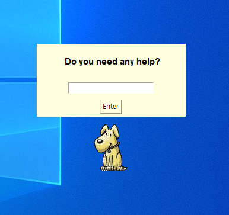

# LLaMA-Powered Rocky AI

An AI chatbot assistant named Rocky powered by LLaMA2




## Supported Platforms

- Windows
- (optional) GPU


## Pre-requisites

- Python for Windows: https://www.python.org/downloads/
- ctransformers: https://github.com/marella/ctransformers
- Llama-2-7B-Chat-GGML model: https://huggingface.co/TheBloke/Llama-2-7B-Chat-GGML/tree/main

- (optional) CUDA, GPU driver


## How to Use

- Install Python for Windows
- Clone this repository

```bash
git clone https://github.com/by-park/llmrocky.git
```

- Install pre-requisites

```bash
pip install ctransformers
```

If GPU is supported, please use this command

```bash
pip install ctransformers[cuda]
```

- Download LLaMA2 (llama-2-7b-chat.ggmlv3.q2_K.bin) and place the model file under the 'model' folder.
- If GPU is not supported, please remove the parameter named 'gpu_layers' in main.py

from (with GPU)

```bash
llm = AutoModelForCausalLM.from_pretrained("model\\llama-2-7b-chat.ggmlv3.q2_K.bin", model_type="llama", gpu_layers=32)
```

to (without GPU)

```bash
llm = AutoModelForCausalLM.from_pretrained("model\\llama-2-7b-chat.ggmlv3.q2_K.bin", model_type="llama")
```

- run the 'main.py' (F5 key for Python default IDLE)

```bash
python main.py
```


## Work in Progress

- TensorRT Support
  - TensorRT-LLM supports GeForce 40 series GPUs: https://github.com/NVIDIA/TensorRT-LLM/tree/main/windows
  
  - LLamA example: https://github.com/NVIDIA/TensorRT-LLM/blob/main/examples/llama/README.md
  
    ```bash
    # With fp16 inference
    python3 ../run.py --max_output_len=50 \
                      --tokenizer_dir ./tmp/llama/7B/ \
                      --engine_dir=./tmp/llama/7B/trt_engines/fp16/1-gpu/
    ```
  
  - TensorRT needs onnx conversion and tensor rt conversion


## Asset Source

- Rocky Animation: https://peacelight14.blogspot.com/2011/02/office-assistant.html

